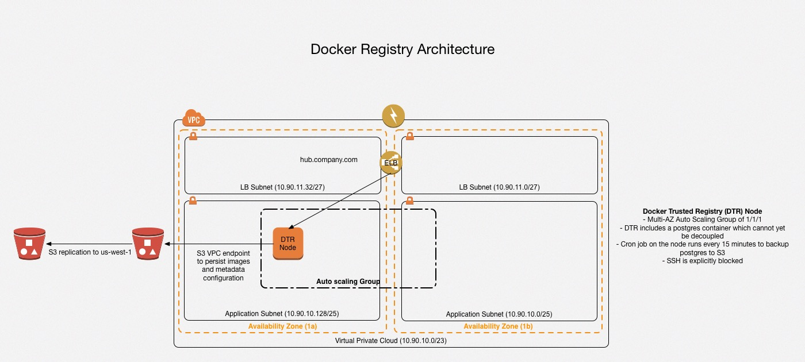

# Docker Trusted Registry

## Architecture
The architecture below depicts the infrastructure built via the CloudFormation template in this repo. It assumes that [cfn-core](https://github.com/alanwill/cfn-core) has already been run and hence the VPC skeleton already exists.

### Reliability
Reliability of DTR is provided via an Auto Scaling Group. Due to being a 1/1/1 ASG this instance will autonomously re-create in the event of service failure. Typical time to self heal is ~7 minutes.

Durability is provided via S3 for all Docker images. These images are also replicated to another region for redundancy.

### Availability
This deployment of DTR is fairly HA and "chaos friendly". In the event of an instance failure or any other problem which prevents the ELB health check from passing the ASG will replace the instance and restore the Postgres database from the most recent backup (no more than 15 minutes prior). Typical time for this restart to occur is ~7 minutes.

### Scalability
Currently DTR does not horizontally scale due to the fact that the Postgres database is coupled into the DTR stack.
